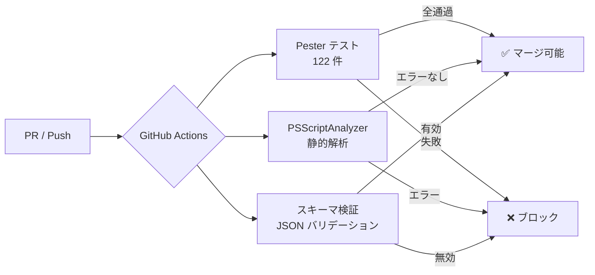
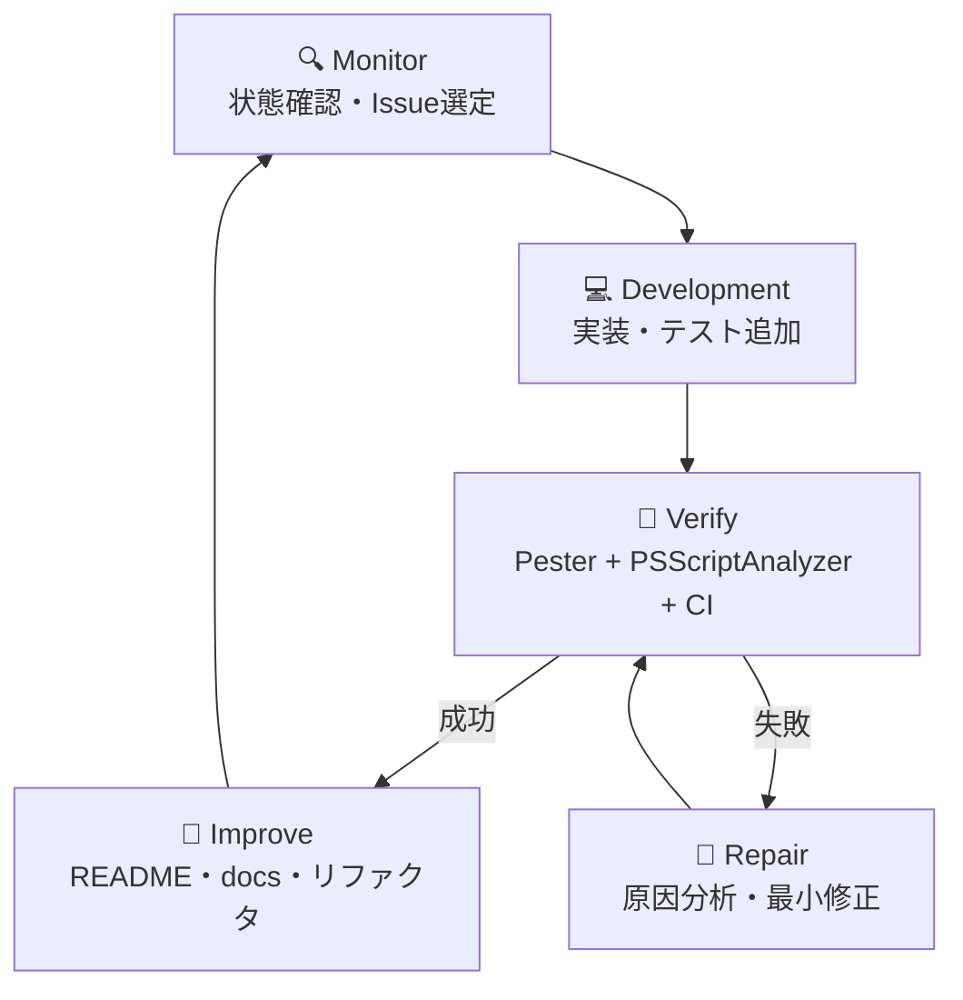

# 🚀 Codex StartUp Tools

> **Codex ネイティブな AI 開発スタートアップツール群**
> 元リポジトリ `ClaudeCode-StartUpTools-New` から再利用可能な資産を抽出し、Codex 向けに再構築したプロジェクトです。

[](https://github.com/Kensan196948G/Codex-StartUpTools-New/actions/workflows/ci.yml)

---

## 📋 目次

- [概要](#概要)
- [アーキテクチャ](#アーキテクチャ)
- [モジュール一覧](#モジュール一覧)
- [セットアップ](#セットアップ)
- [使い方](#使い方)
- [設定ファイル](#設定ファイル)
- [テスト](#テスト)
- [CI/CD](#cicd)
- [開発フロー](#開発フロー)
- [移植方針](#移植方針)

---

## 概要

このリポジトリは **Codex を主たる開発エージェント**として使うことを前提にした、スタートアップツール群です。

| 項目 | 内容 |
|---|---|
| 対象ツール | Codex (OpenAI), Claude (Anthropic) |
| プラットフォーム | Windows (PowerShell 7+) |
| テストフレームワーク | Pester 5.x |
| CI | GitHub Actions (windows-latest) |
| 設定形式 | JSON |

---

## アーキテクチャ

```mermaid
graph TD
    subgraph エントリポイント
        A[Start-Codex.ps1]
        B[Start-CodexBootstrap.ps1]
    end

    subgraph コアライブラリ
        C[LauncherCommon.psm1]
        D[Config.psm1]
        E[ConfigSchema.ps1]
        F[TokenBudget.psm1]
        G[McpHealthCheck.psm1]
        H[MessageBus.psm1]
        I[LogManager.psm1]
        J[ErrorHandler.psm1]
    end

    subgraph ユーティリティ
        K[RecentProjects.ps1]
        L[SessionTabManager.psm1]
        M[StatuslineManager.psm1]
        N[WorktreeManager.psm1]
        O[ArchitectureCheck.psm1]
    end

    subgraph 設定・状態
        P[config/config.json]
        Q[state.json]
    end

    A --> C
    A --> D
    A --> F
    A --> G
    A --> H
    A --> I
    A --> J
    B --> C
    B --> D
    B --> F
    B --> G
    B --> H
    B --> I
    B --> J
    C --> P
    D --> P
    F --> Q
    H --> Q
```

---

## モジュール一覧

### エントリポイント

| スクリプト | 説明 |
|---|---|
| `scripts/main/Start-Codex.ps1` | メインランチャー。設定読み込み・ツール選択・起動を行う |
| `scripts/main/Start-CodexBootstrap.ps1` | ブートストラップ。preflight チェック・state 初期化・フェーズ遷移通知を担う |

### コアライブラリ (`scripts/lib/`)

| モジュール | 責務 |
|---|---|
| `LauncherCommon.psm1` | 共通ユーティリティ（設定パス解決、スキーマ検証、起動）|
| `Config.psm1` | config.json の読み込み・バックアップ・センシティブ情報マスキング |
| `ConfigSchema.ps1` | 設定スキーマ定義と検証ロジック |
| `TokenBudget.psm1` | トークン使用量の追跡・ゾーン判定（Green/Yellow/Red）|
| `McpHealthCheck.psm1` | MCP サーバーの健全性診断 |
| `MessageBus.psm1` | 状態ファイルを介したフェーズ遷移メッセージング |
| `LogManager.psm1` | セッションログの開始・停止・ローテーション |
| `ErrorHandler.psm1` | 標準化されたエラー通知・詳細出力 |

### ユーティリティ (`scripts/lib/`)

| モジュール | 責務 |
|---|---|
| `RecentProjects.ps1` | 最近使ったプロジェクト履歴の管理 |
| `SessionTabManager.psm1` | ターミナルタブ管理 |
| `StatuslineManager.psm1` | ステータスライン表示制御 |
| `WorktreeManager.psm1` | Git worktree の作成・切替・削除 |
| `ArchitectureCheck.psm1` | プロジェクト構成の整合性チェック |

---

## セットアップ

### 前提条件

| 必須 | バージョン |
|---|---|
| PowerShell | 7.0 以上 |
| Git | 2.x 以上 |
| Codex CLI | 最新版 (`npm install -g @openai/codex`) |

### 手順

```powershell
# 1. リポジトリのクローン
git clone https://github.com/Kensan196948G/Codex-StartUpTools-New.git
cd Codex-StartUpTools-New

# 2. 設定ファイルの作成
Copy-Item config/config.json.template config/config.json
# config/config.json を編集して projectsDir 等を設定

# 3. state.json の初期化（ブートストラップが自動生成）
# または手動で作成
Copy-Item state.json.example state.json

# 4. ブートストラップ実行（preflight チェック）
pwsh scripts/main/Start-CodexBootstrap.ps1
```

---

## 使い方

### Codex 起動

```powershell
# 通常起動
pwsh scripts/main/Start-Codex.ps1

# ドライラン（実際には起動しない）
pwsh scripts/main/Start-Codex.ps1 -DryRun

# 非インタラクティブモード
pwsh scripts/main/Start-Codex.ps1 -NonInteractive
```

### ブートストラップ

```powershell
# preflight チェックのみ
pwsh scripts/main/Start-CodexBootstrap.ps1 -DryRun
```

---

## 設定ファイル

### `config/config.json`

`config/config.json.template` をコピーして編集します。

| キー | 説明 | 例 |
|---|---|---|
| `projectsDir` | プロジェクトルートディレクトリ | `"D:\\"` |
| `tools.defaultTool` | デフォルト使用ツール | `"codex"` |
| `tools.codex.command` | Codex コマンド名 | `"codex"` |
| `logging.logDir` | ログ出力先ディレクトリ | `"logs"` |
| `recentProjects.maxHistory` | 最近使ったプロジェクトの最大件数 | `10` |

### `state.json`

実行時の状態を保持するファイル。`state.json.example` を参考に作成します。

| キー | 説明 |
|---|---|
| `goal.title` | 現在のゴールタイトル |
| `execution.phase` | 現在の実行フェーズ（Monitor/Build/Verify/Improve）|
| `token.used` | 使用済みトークン率（%）|
| `status.stable` | STABLE 判定フラグ |

---

## テスト

```powershell
# Pester のインストール（初回のみ）
Install-Module Pester -MinimumVersion 5.0 -Force

# 全ユニットテストの実行
Invoke-Pester -Path tests/unit/ -Output Detailed

# 特定テストファイルの実行
Invoke-Pester -Path tests/unit/Config.Tests.ps1 -Output Detailed
```

### テストカバレッジ

| テストファイル | 対象モジュール |
|---|---|
| `ArchitectureCheck.Tests.ps1` | `ArchitectureCheck.psm1` |
| `Config.Tests.ps1` | `Config.psm1` |
| `ConfigSchema.Tests.ps1` | `ConfigSchema.ps1` |
| `ErrorHandler.Tests.ps1` | `ErrorHandler.psm1` |
| `LauncherCommon.Tests.ps1` | `LauncherCommon.psm1` |
| `LogManager.Tests.ps1` | `LogManager.psm1` |
| `McpHealthCheck.Tests.ps1` | `McpHealthCheck.psm1` |
| `MessageBus.Tests.ps1` | `MessageBus.psm1` |
| `RecentProjects.Tests.ps1` | `RecentProjects.ps1` |
| `SessionTabManager.Tests.ps1` | `SessionTabManager.psm1` |
| `StartCodex.Tests.ps1` | `Start-Codex.ps1` |
| `StartCodexBootstrap.Tests.ps1` | `Start-CodexBootstrap.ps1` |
| `StateSchema.Tests.ps1` | `state.schema.json` |
| `StatuslineManager.Tests.ps1` | `StatuslineManager.psm1` |
| `TokenBudget.Tests.ps1` | `TokenBudget.psm1` |
| `WorktreeManager.Tests.ps1` | `WorktreeManager.psm1` |

---

## CI/CD



| ジョブ | 内容 | ランナー |
|---|---|---|
| `test` | Pester ユニットテスト (122件) | windows-latest |
| `lint` | PSScriptAnalyzer 静的解析 | windows-latest |
| `schema-validation` | JSON スキーマ検証 | windows-latest |

---

## 開発フロー



| フェーズ | 主な作業 |
|---|---|
| Monitor | GitHub Issues 確認、CI 状態確認、タスク分解 |
| Development | 機能単位での実装、テスト追加 |
| Verify | `Invoke-Pester` + PSScriptAnalyzer + CI 確認 |
| Improve | README 更新、ドキュメント整備、リファクタ |

---

## 移植方針

元リポジトリ `ClaudeCode-StartUpTools-New` の資産は以下のカテゴリに分類して移植します。

| 分類 | 説明 | 例 |
|---|---|---|
| ✅ そのまま移植 | Codex/Claude 両対応で変更不要 | ログ管理、設定読み込み |
| ⚙️ 調整して移植 | 軽微な修正で Codex 対応可能 | 起動スクリプト |
| 🔄 Codex向け置換実装 | Claude 専用依存を除去・再設計 | Hook 機能 |
| 📚 参考資料として保管 | 設計参考のみ（実装しない）| Claude 固有設定 |
| ❌ 移植しない | Codex 環境では不要 | Claude API 専用モジュール |

---

*このリポジトリは ClaudeOS v8 自律開発システムにより継続的に改善されています。*
